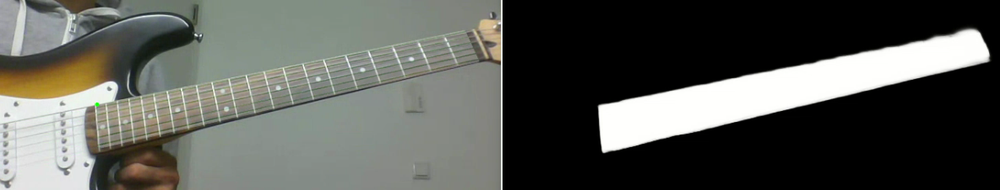

# Guitar - Augmented Reality - Deep Learning
#

* Guitar fretboard detection (using Deep Learning - UNet)
* Projecting a mesh on the detected fretboard (using Homography)
* Displaying the notes to play on the projected mesh


### Environment Setup
```sh
# Docker container to run train.py and prediction.py
./docker_start_pred.sh

# Docker container to run main.py
./docker_start.sh
```

### Dataset
```sh
# Add training images to data/guitar/train/image/
# Add corresponding training mask images to data/guitar/train/labels/

# Use data_aug_offline.py to augment dataset offline[Optional]
pyhon3 data_aug_offline.py
```

## Details
* Train the model using train.py
* Predict fretboard segmentation using prediction.py
* Project mesh on to the guitar fretboard using main.py

## Results


## References
https://github.com/zhixuhao/unet

